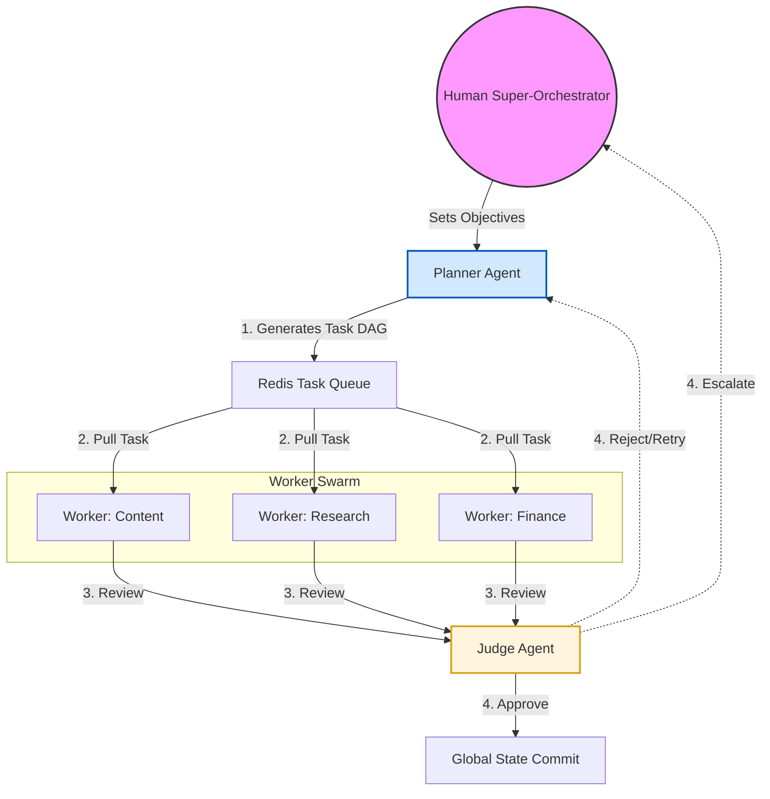
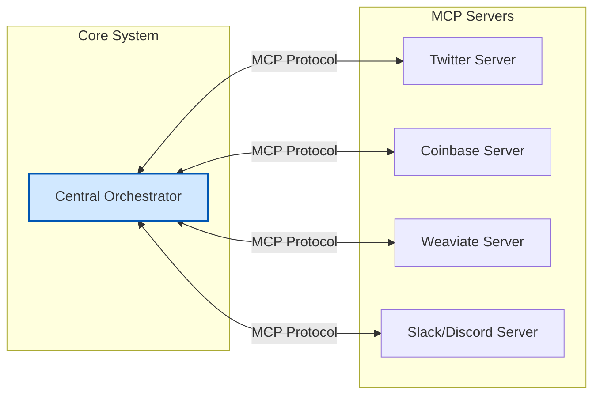

# Project Chimera: Domain Architecture Strategy

## 1. Agent Orchestration Pattern: FastRender Swarm
We have selected the **Hierarchical Swarm (FastRender Pattern)** to manage the complexity of an autonomous influencer network. This pattern optimizes for throughput, error recovery, and decision quality by specializing agents into three distinct roles.

### 1.1 Role Specialization
* **The Planner (Strategist):** Acts as the cognitive core. It monitors global state and goals to decompose abstract objectives into a **Directed Acyclic Graph (DAG)** of executable tasks.
* **The Worker (Executor):** Stateless and ephemeral agents that pull single atomic tasks from a queue (e.g., content generation, market research). They operate in a "shared-nothing" architecture to prevent cascading failures.
* **The Judge (Gatekeeper):** The quality assurance layer. It reviews every Worker output against brand safety, persona consistency (SOUL.md), and acceptance criteria before finalization.

### 1.2 Swarm Architecture Diagram

---

## 2. Safety Layer: Human-in-the-Loop (HITL)
To balance velocity with safety, we implement a Probability-Based HITL Framework driven by dynamic confidence thresholds.

* **Confidence Scoring:** Every Worker output includes a `confidence_score` (0.0 to 1.0) derived from the LLM's probability estimation.
* **High Confidence (> 0.90):** Auto-Approve. Actions execute immediately without human intervention.
* **Medium Confidence (0.70 - 0.90):** Async Approval. The specific action is paused and added to the Orchestrator Dashboard queue for human review. The swarm continues other parallel tasks.
* **Low Confidence (< 0.70):** Reject/Retry. The Judge automatically triggers a retry with refined prompts from the Planner.

---

## 3. Data Strategy: Hybrid Infrastructure
To manage high-velocity video metadata and long-term memory, we use a tiered storage approach.

* **Transactional Data (SQL - PostgreSQL):** Used for strictly structured data including user accounts, campaign configurations, and high-integrity operational logs.
* **Semantic Memory (Vector - Weaviate):** Stores the agent's "long-term consciousness," persona definitions (SOUL.md), and world knowledge for RAG pipelines.
* **Episodic Cache (Redis):** Handles short-term conversation history (last 1 hour) and the high-speed task queue.
* **Financial Ledger (Blockchain):** Uses the Base network via Coinbase AgentKit for an immutable record of all agentic commerce.

---

## 4. Integration Layer: Model Context Protocol (MCP)
The system adopts a Hub-and-Spoke Topology via MCP to decouple core reasoning from external tools.

* **Host (Hub):** The Central Orchestrator runs an MCP Client to aggregate capabilities.
* **Servers (Spokes):** Independent services wrapping external APIs (e.g., `mcp-server-twitter`, `mcp-server-coinbase`, `mcp-server-weaviate`).

### 4.1 Hub-and-Spoke Topology

