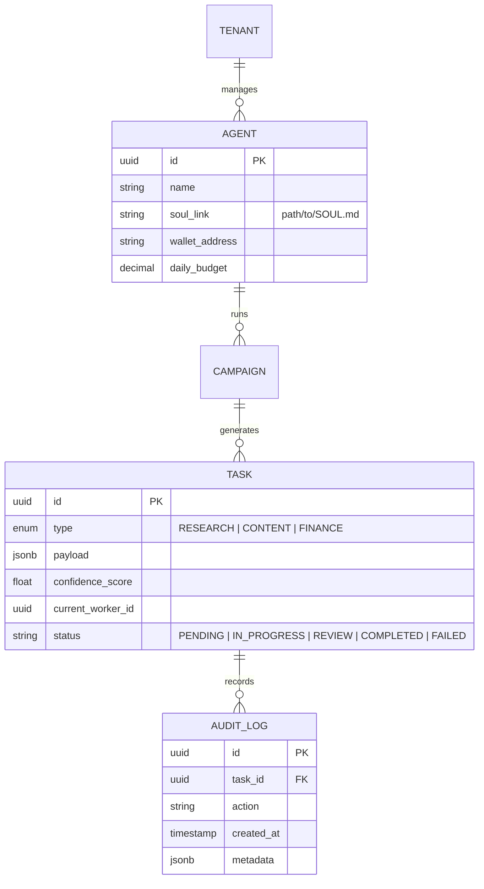

# Project Chimera: Technical Specification

## 1. System ERD (Database Schema)

The system utilizes PostgreSQL for transactional state and Weaviate for semantic memory.



## 2. API & Data Contracts

### 2.1 AgentTask Schema
All agents must adhere to the validated Pydantic model in `schemas/contracts.py`.

```json
{
  "title": "AgentTask",
  "type": "object",
  "properties": {
    "task_id": { "type": "string", "format": "uuid" },
    "type": { "enum": ["RESEARCH", "CONTENT_GEN", "TRANSACTION", "ENGAGEMENT"] },
    "payload": { "type": "object" },
    "status": { "type": "string" },
    "confidence_score": { "type": "number" }
  },
  "required": ["task_id", "type", "payload", "status"]
}
```

### 2.2 MCP Tool Contract: `get_market_trend`
```json
{
  "name": "get_market_trend",
  "description": "Fetches top 10 trends for a specified niche via MCP.",
  "arguments": {
    "niche": { "type": "string", "enum": ["DEFI", "NFT", "AI", "MACRO"] },
    "limit": { "type": "integer", "default": 5 }
  }
}
```

## 3. Tech Stack
- **Runtime**: Python 3.12 (uv)
- **Messaging**: Redis (Pub/Sub)
- **DB**: PostgreSQL + Weaviate
- **Orchestration**: Docker + Kubernetes
- **Intelligence**: Gemini 3 Flash (via MCP)
